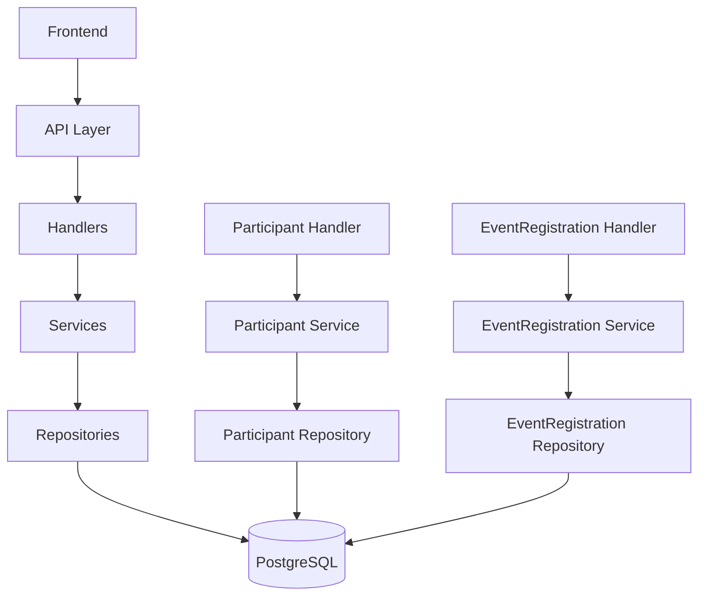

# 🔐 Participant (Aanmeldingen) System - Complete Technical Guide

> **Version:** 1.0
> **Status:** Production Ready
> **Last Updated:** 2025-11-06
> **Backend:** DKL Email Service V1.48.0+

Complete technische documentatie van het participant (aanmeldingen) systeem voor het beheren van deelnemers aan loopwedstrijden.

---

## 📋 Inhoudsopgave

1. [Executive Summary](#executive-summary)
2. [System Architecture](#system-architecture)
3. [Database Schema](#database-schema)
4. [API Endpoints](#api-endpoints)
5. [Models & Data Structures](#models--data-structures)
6. [Business Logic](#business-logic)
7. [Migration History](#migration-history)
8. [Testing](#testing)
9. [Related Documentation](#related-documentation)

---

## 🎯 Executive Summary

Het DKL Email Service implementeert een enterprise-grade participant management systeem met:

### Kernfunctionaliteit
- ✅ **Participant Management** - CRUD operaties voor deelnemers (personen)
- ✅ **Event Registration** - Koppeling tussen deelnemers en evenementen
- ✅ **Role-Based Access** - Rollen en afstanden per registratie
- ✅ **Answer System** - Antwoorden op participant vragen
- ✅ **Gamification Support** - Steps tracking en badges
- ✅ **Email Integration** - Automatische email notificaties

### Technische Stack
- **Backend:** Go + Fiber framework
- **Database:** PostgreSQL met GORM ORM
- **Architecture:** Repository pattern + Service layer
- **API:** RESTful endpoints met JWT authentication
- **Migration System:** Database versioning via golang-migrate

---

## 🏗️ System Architecture

### Component Overview



### Data Flow

1. **Registration Process:**
   ```
   AanmeldingFormulier (DTO)
   ↓
   Split into: Participant + EventRegistration
   ↓
   Stored in separate tables
   ```

2. **Participant Management:**
   ```
   Participant (persoonsgegevens)
   ↙️     ↘️
   EventRegistration (deelname-specifiek)
   ↙️         ↘️
   ParticipantAntwoord (communicatie)
   ```

### Key Design Decisions

- **Separation of Concerns:** Persoonsgegevens vs. deelname-specifiek data
- **Event-Centric:** Elke registratie is gekoppeld aan een event
- **Flexible Roles:** Rollen per registratie, niet per persoon
- **Answer System:** Direct gekoppeld aan participant, niet registratie

---

## 🗄️ Database Schema

### Core Tables

#### `participants` - Persoonsgegevens
```sql
CREATE TABLE participants (
    id UUID PRIMARY KEY DEFAULT gen_random_uuid(),
    created_at TIMESTAMP WITH TIME ZONE DEFAULT CURRENT_TIMESTAMP,
    updated_at TIMESTAMP WITH TIME ZONE DEFAULT CURRENT_TIMESTAMP,
    naam VARCHAR(255) NOT NULL,
    email VARCHAR(255) NOT NULL,
    telefoon VARCHAR(50),
    terms BOOLEAN NOT NULL,
    gebruiker_id UUID, -- Optional link to user account
    steps INTEGER DEFAULT 0,

    -- Foreign key constraint
    CONSTRAINT fk_participants_gebruiker
        FOREIGN KEY (gebruiker_id) REFERENCES gebruikers(id) ON DELETE SET NULL,

    -- Indexes
    INDEX idx_participants_email (email),
    INDEX idx_participants_gebruiker_id (gebruiker_id)
);
```

#### `event_registrations` - Deelname-specifieke data
```sql
CREATE TABLE event_registrations (
    id UUID PRIMARY KEY DEFAULT gen_random_uuid(),
    event_id UUID NOT NULL,
    participant_id UUID NOT NULL,
    registered_at TIMESTAMP WITH TIME ZONE DEFAULT CURRENT_TIMESTAMP,

    -- Tracking fields
    check_in_time TIMESTAMP WITH TIME ZONE,
    start_time TIMESTAMP WITH TIME ZONE,
    finish_time TIMESTAMP WITH TIME ZONE,
    tracking_status VARCHAR(50) DEFAULT 'registered',

    -- Registration-specific data (moved from aanmeldingen)
    steps INTEGER DEFAULT 0,
    test_mode BOOLEAN NOT NULL DEFAULT FALSE,
    ondersteuning VARCHAR(255),
    bijzonderheden TEXT,
    notities TEXT,
    behandeld_door VARCHAR(255),
    behandeld_op TIMESTAMP WITH TIME ZONE,
    email_verzonden BOOLEAN DEFAULT FALSE,
    email_verzonden_op TIMESTAMP WITH TIME ZONE,

    -- Foreign keys (normalized)
    status_key VARCHAR(50),
    distance_route VARCHAR(100),
    participant_role_name VARCHAR(100),

    -- Constraints
    UNIQUE(event_id, participant_id),
    FOREIGN KEY (event_id) REFERENCES events(id) ON DELETE CASCADE,
    FOREIGN KEY (participant_id) REFERENCES participants(id) ON DELETE CASCADE,
    FOREIGN KEY (status_key) REFERENCES registration_statuses(type),
    FOREIGN KEY (distance_route) REFERENCES distances(route),
    FOREIGN KEY (participant_role_name) REFERENCES participant_roles(name),

    -- Indexes
    INDEX idx_event_registrations_event_id (event_id),
    INDEX idx_event_registrations_participant_id (participant_id),
    INDEX idx_event_registrations_status_key (status_key),
    INDEX idx_event_registrations_distance_route (distance_route),
    INDEX idx_event_registrations_participant_role_name (participant_role_name)
);
```

#### `participant_antwoorden` - Communicatie
```sql
CREATE TABLE participant_antwoorden (
    id UUID PRIMARY KEY DEFAULT gen_random_uuid(),
    participant_id UUID NOT NULL,
    tekst TEXT NOT NULL,
    verzonden_op TIMESTAMP WITH TIME ZONE DEFAULT CURRENT_TIMESTAMP,
    verzond_door VARCHAR(255) NOT NULL,
    email_verzonden BOOLEAN DEFAULT FALSE,

    -- Foreign key
    FOREIGN KEY (participant_id) REFERENCES participants(id) ON DELETE CASCADE,

    -- Index
    INDEX idx_participant_antwoorden_participant_id (participant_id)
);
```

### Supporting Tables

#### `participant_roles` - Rollen per registratie
```sql
CREATE TABLE participant_roles (
    name VARCHAR(100) PRIMARY KEY,
    description TEXT,
    created_at TIMESTAMP WITH TIME ZONE DEFAULT CURRENT_TIMESTAMP,

    -- Sample data: 'deelnemer', 'vrijwilliger', 'begeleider', etc.
);
```

#### `distances` - Afstanden/routes
```sql
CREATE TABLE distances (
    route VARCHAR(100) PRIMARY KEY,
    amount DECIMAL(10,2) NOT NULL, -- Distance in KM
    description TEXT,
    created_at TIMESTAMP WITH TIME ZONE DEFAULT CURRENT_TIMESTAMP,

    -- Sample data: '5 KM', '10 KM', '20 KM', etc.
);
```

#### `registration_statuses` - Status lifecycle
```sql
CREATE TABLE registration_statuses (
    type VARCHAR(50) PRIMARY KEY,
    description TEXT,
    created_at TIMESTAMP WITH TIME ZONE DEFAULT CURRENT_TIMESTAMP,

    -- Sample data: 'nieuw', 'bevestigd', 'beantwoord', 'geannuleerd', etc.
);
```

---

## 🔌 API Endpoints

### Participant Endpoints (`/api/participant`)

#### `GET /api/participant`
- **Purpose:** List all participants
- **Auth:** JWT required
- **Permissions:** `participant:read`
- **Query Params:**
  - `limit` (int, default: 10, max: 10000)
  - `offset` (int, default: 0)
- **Response:** Array of `Participant` objects

#### `GET /api/participant/{id}`
- **Purpose:** Get specific participant with answers and registrations
- **Auth:** JWT required
- **Permissions:** `participant:read`
- **Response:**
```json
{
  "participant": {...},
  "event_registrations": [...]
}
```

#### `POST /api/participant/{id}/antwoord`
- **Purpose:** Add answer to participant
- **Auth:** JWT required
- **Permissions:** `participant:write`
- **Body:**
```json
{
  "tekst": "Antwoord tekst"
}
```
- **Side Effects:**
  - Updates registration status to "beantwoord"
  - Sends email to participant
  - Updates `email_verzonden` status

#### `DELETE /api/participant/{id}`
- **Purpose:** Delete participant (cascades to registrations and answers)
- **Auth:** JWT required
- **Permissions:** `participant:delete`

### Event Registration Endpoints (`/api/registration`)

#### `GET /api/registration/{id}`
- **Purpose:** Get specific registration
- **Auth:** JWT required
- **Permissions:** `participant:read`

#### `PUT /api/registration/{id}`
- **Purpose:** Update registration (status, notes, etc.)
- **Auth:** JWT required
- **Permissions:** `participant:write`
- **Body:**
```json
{
  "status_key": "beantwoord",
  "notities": "Extra informatie"
}
```

#### `GET /api/registration/rol/{rol}`
- **Purpose:** List registrations by role
- **Auth:** JWT required
- **Permissions:** `participant:read`
- **Example:** `/api/registration/rol/deelnemer`

### Legacy Endpoints (Deprecated)

#### `GET /api/participant/rol/{rol}` - **DEPRECATED**
- **Status:** 501 Not Implemented
- **Replacement:** `/api/registration/rol/{rol}`
- **Reason:** Logic moved to EventRegistrationHandler

---

## 📊 Models & Data Structures

### Core Models

#### `Participant` - Persoonsgegevens
```go
type Participant struct {
    ID          string    `json:"id" gorm:"primaryKey;type:uuid"`
    CreatedAt   time.Time `json:"created_at" gorm:"autoCreateTime"`
    UpdatedAt   time.Time `json:"updated_at" gorm:"autoUpdateTime"`
    Naam        string    `json:"naam" gorm:"not null"`
    Email       string    `json:"email" gorm:"not null;index"`
    Telefoon    string    `json:"telefoon"`
    Terms       bool      `json:"terms" gorm:"not null"`
    GebruikerID *string   `json:"gebruiker_id,omitempty" gorm:"type:uuid;index"`

    // Gamification
    Steps int `json:"steps" gorm:"default:0"`

    // Relations
    Antwoorden []ParticipantAntwoord `json:"antwoorden,omitempty" gorm:"foreignKey:ParticipantID"`
    EventRegistrations []EventRegistration `json:"event_registrations,omitempty" gorm:"foreignKey:ParticipantID"`
}
```

#### `EventRegistration` - Deelname-specifieke data
```go
type EventRegistration struct {
    ID            string     `json:"id" gorm:"primaryKey;type:uuid"`
    EventID       string     `json:"event_id" gorm:"type:uuid;not null;index"`
    ParticipantID string     `json:"participant_id" gorm:"type:uuid;not null;index"`
    RegisteredAt  time.Time  `json:"registered_at" gorm:"autoCreateTime"`

    // Tracking
    CheckInTime   *time.Time `json:"check_in_time"`
    StartTime     *time.Time `json:"start_time"`
    FinishTime    *time.Time `json:"finish_time"`
    TrackingStatus *string   `json:"tracking_status" gorm:"default:'registered'"`

    // Registration data (moved from aanmeldingen)
    Steps            int        `json:"steps" gorm:"default:0"`
    TestMode         bool       `json:"test_mode" gorm:"type:boolean;not null;default:false"`
    Ondersteuning    string     `json:"ondersteuning"`
    Bijzonderheden   string     `json:"bijzonderheden" gorm:"type:text"`
    Notities         *string    `json:"notities" gorm:"type:text"`
    BehandeldDoor    *string    `json:"behandeld_door"`
    BehandeldOp      *time.Time `json:"behandeld_op"`
    EmailVerzonden   bool       `json:"email_verzonden" gorm:"default:false"`
    EmailVerzondenOp *time.Time `json:"email_verzonden_op"`

    // Normalized foreign keys
    StatusKey          *string                `json:"status_key" gorm:"index"`
    RegistrationStatus RegistrationStatusType `json:"status,omitempty" gorm:"foreignKey:StatusKey"`

    DistanceRoute *string  `json:"distance_route" gorm:"index"`
    Distance      Distance `json:"distance,omitempty" gorm:"foreignKey:DistanceRoute"`

    ParticipantRoleName *string         `json:"participant_role_name" gorm:"index"`
    ParticipantRole     ParticipantRole `json:"role,omitempty" gorm:"foreignKey:ParticipantRoleName"`

    // Relations
    Participant Participant `json:"participant,omitempty" gorm:"foreignKey:ParticipantID"`
    Event       Event       `json:"event,omitempty" gorm:"foreignKey:EventID"`
}
```

#### `ParticipantAntwoord` - Communicatie
```go
type ParticipantAntwoord struct {
    ID             string    `json:"id" gorm:"primaryKey;type:uuid"`
    ParticipantID  string    `json:"participant_id" gorm:"not null;index"`
    Tekst          string    `json:"tekst" gorm:"type:text;not null"`
    VerzondOp      time.Time `json:"verzonden_op" gorm:"autoCreateTime"`
    VerzondDoor    string    `json:"verzond_door" gorm:"not null"`
    EmailVerzonden bool      `json:"email_verzonden" gorm:"default:false"`

    // Relation
    Participant Participant `json:"-" gorm:"foreignKey:ParticipantID"`
}
```

### DTOs

#### `AanmeldingFormulier` - Registration Form
```go
type AanmeldingFormulier struct {
    Naam           string `json:"naam"`
    Email          string `json:"email"`
    Telefoon       string `json:"telefoon"`
    Rol            string `json:"rol"`
    Afstand        string `json:"afstand"`
    Ondersteuning  string `json:"ondersteuning"`
    Bijzonderheden string `json:"bijzonderheden"`
    Terms          bool   `json:"terms"`
    TestMode       bool   `json:"test_mode"`
}
```

---

## 🧠 Business Logic

### Registration Process

```go
// 1. Receive AanmeldingFormulier
form := AanmeldingFormulier{...}

// 2. Create Participant (personal data)
participant := &models.Participant{
    Naam:     form.Naam,
    Email:    form.Email,
    Telefoon: form.Telefoon,
    Terms:    form.Terms,
}

// 3. Create EventRegistration (event-specific data)
registration := &models.EventRegistration{
    ParticipantID:       participant.ID,
    EventID:            currentEvent.ID,
    TestMode:           form.TestMode,
    Ondersteuning:      form.Ondersteuning,
    Bijzonderheden:     form.Bijzonderheden,
    ParticipantRoleName: &form.Rol,
    DistanceRoute:      &form.Afstand,
    StatusKey:          stringPtr("nieuw"),
}

// 4. Save both
participantRepo.Create(ctx, participant)
eventRegRepo.Create(ctx, registration)
```

### Answer System Logic

```go
func (h *ParticipantHandler) AddParticipantAntwoord(c *fiber.Ctx) error {
    // 1. Validate participant exists
    participant, err := h.participantRepo.GetByID(ctx, participantID)

    // 2. Create answer
    antwoord := &models.ParticipantAntwoord{
        ParticipantID:  participantID,
        Tekst:          requestData.Tekst,
        VerzondDoor:    currentUser.Email,
        EmailVerzonden: false,
    }

    // 3. Update registration status to "beantwoord"
    activeReg, err := h.eventRegRepo.GetActiveRegistrationForParticipant(ctx, participantID)
    if activeReg != nil {
        statusKey := "beantwoord"
        activeReg.StatusKey = &statusKey
        activeReg.BehandeldDoor = &currentUser.Email
        activeReg.BehandeldOp = &time.Now()
        h.eventRegRepo.Update(ctx, activeReg)
    }

    // 4. Send email asynchronously
    go func() {
        err := h.emailService.SendEmail(participant.Email, "Antwoord op uw registratie", requestData.Tekst)
        if err == nil {
            antwoord.EmailVerzonden = true
            h.participantAntwoordRepo.Update(bgCtx, antwoord)
        }
    }()

    return c.JSON(antwoord)
}
```

### Status Management

**Registration Status Flow:**
```
nieuw → bevestigd → beantwoord → (completed/cancelled)
```

**Tracking Status Flow:**
```
registered → started → finished
```

---

## 📋 Migration History

### V26-V28: Major Refactoring

#### V26: Participant Roles & Distances
- **V26_01:** Create `participant_roles` table
- **V26_02:** Add comments to participant_roles
- **V26_03:** Seed participant roles data
- **V26_04:** Add `participant_role_name` column to event_registrations
- **V26_05:** Migrate existing role data
- **V26_06:** Add foreign key constraint for participant_role
- **V26_07:** Rename `route_funds` to `distances`
- **V26_08:** Rename `amount` column to `distance` in distances
- **V26_09:** Add primary key to distances
- **V26_10:** Add comments to distances
- **V26_11:** Add `distance_route` column to event_registrations
- **V26_12:** Migrate distance data

#### V27: Status Normalization
- **V27:** Normalize all status and type fields
  - Create `registration_statuses` table
  - Add `status_key` column to event_registrations
  - Migrate existing status data

#### V28: Data Separation (Major)
- **Split `aanmeldingen` table into:**
  - `participants` - Personal data only
  - `event_registrations` - Event-specific data
- **Move fields:**
  - Personal: naam, email, telefoon, terms, gebruiker_id
  - Event-specific: rol, afstand, ondersteuning, bijzonderheden, status, etc.
- **Update all handlers and repositories**
- **Maintain backward compatibility with aliases**

### Key Migration Patterns

```sql
-- Pattern: Add column with default
ALTER TABLE event_registrations ADD COLUMN status_key VARCHAR(50);

-- Pattern: Migrate data
UPDATE event_registrations SET status_key = 'nieuw' WHERE status = 'nieuw';

-- Pattern: Add foreign key
ALTER TABLE event_registrations
ADD CONSTRAINT fk_event_registrations_status
FOREIGN KEY (status_key) REFERENCES registration_statuses(type);

-- Pattern: Drop old column
ALTER TABLE event_registrations DROP COLUMN status;
```

---

## 🧪 Testing

### Unit Tests

#### Repository Tests
```go
func TestParticipantRepository_GetByID(t *testing.T) {
    // Setup
    repo := setupTestParticipantRepo(t)

    // Create test participant
    participant := &models.Participant{
        Naam:  "Test User",
        Email: "test@example.com",
        Terms: true,
    }
    err := repo.Create(context.Background(), participant)
    assert.NoError(t, err)

    // Test GetByID
    retrieved, err := repo.GetByID(context.Background(), participant.ID)
    assert.NoError(t, err)
    assert.NotNil(t, retrieved)
    assert.Equal(t, participant.Naam, retrieved.Naam)
}
```

#### Handler Tests
```go
func TestParticipantHandler_ListParticipants(t *testing.T) {
    // Setup
    app, handler := setupTestParticipantHandler(t)

    // Create test data
    createTestParticipants(t, handler.participantRepo)

    // Test request
    req := httptest.NewRequest("GET", "/api/participant?limit=10", nil)
    resp, err := app.Test(req)
    assert.NoError(t, err)
    assert.Equal(t, 200, resp.StatusCode)

    // Parse response
    var participants []models.Participant
    err = json.NewDecoder(resp.Body).Decode(&participants)
    assert.NoError(t, err)
    assert.True(t, len(participants) > 0)
}
```

### Integration Tests

#### API Integration Test
```go
func TestParticipantAPI_CompleteFlow(t *testing.T) {
    // Setup full application
    app := setupTestApp(t)

    // 1. Create participant via API
    participantData := `{
        "naam": "Integration Test",
        "email": "integration@example.com",
        "terms": true
    }`

    req := httptest.NewRequest("POST", "/api/participant", strings.NewReader(participantData))
    req.Header.Set("Content-Type", "application/json")
    req.Header.Set("Authorization", "Bearer "+testToken)

    resp, err := app.Test(req)
    assert.NoError(t, err)
    assert.Equal(t, 201, resp.StatusCode)

    // 2. Get participant
    var createdParticipant models.Participant
    json.NewDecoder(resp.Body).Decode(&createdParticipant)

    // 3. Add answer
    answerData := `{"tekst": "Test antwoord"}`
    req = httptest.NewRequest("POST", "/api/participant/"+createdParticipant.ID+"/antwoord", strings.NewReader(answerData))
    req.Header.Set("Content-Type", "application/json")
    req.Header.Set("Authorization", "Bearer "+testToken)

    resp, err = app.Test(req)
    assert.NoError(t, err)
    assert.Equal(t, 200, resp.StatusCode)
}
```

### Test Data Setup

```go
func createTestParticipants(t *testing.T, repo repository.ParticipantRepository) []*models.Participant {
    participants := []*models.Participant{
        {
            Naam:  "Alice Johnson",
            Email: "alice@example.com",
            Terms: true,
            Steps: 1500,
        },
        {
            Naam:  "Bob Smith",
            Email: "bob@example.com",
            Terms: true,
            Steps: 2300,
        },
    }

    for _, p := range participants {
        err := repo.Create(context.Background(), p)
        assert.NoError(t, err)
    }

    return participants
}
```

---

## 📚 Related Documentation

- [`01DATABASE_DOC.md`](01DATABASE_DOC.md) - Database architecture overview
- [`02AUTHENTICATION_DOC.md`](02AUTHENTICATION_DOC.md) - Authentication & authorization system
- [`docs/architecture/database-schema.md`](docs/architecture/database-schema.md) - Complete database schema
- [`docs/STEPS_API_FRONTEND.md`](docs/STEPS_API_FRONTEND.md) - Steps tracking API
- [`docs/USER_PARTICIPANT_LINKING.md`](docs/USER_PARTICIPANT_LINKING.md) - User-participant relationships
- [`docs/EVENT_TRACKING_IMPLEMENTATION.md`](docs/EVENT_TRACKING_IMPLEMENTATION.md) - Event tracking system

---

## ⚠️ Critical Implementation Notes

### Data Integrity
- **Cascade Deletes:** Participant deletion cascades to registrations and answers
- **Unique Constraints:** One registration per participant per event
- **Foreign Keys:** All relationships properly constrained

### Performance Considerations
- **Indexes:** All foreign keys and commonly queried columns indexed
- **Preloading:** Relations loaded on-demand to prevent N+1 queries
- **Pagination:** All list endpoints support limit/offset pagination

### Migration Safety
- **Backward Compatibility:** Legacy endpoints return 501 with migration guidance
- **Data Preservation:** All existing data migrated safely
- **Rollback Support:** Migrations designed for safe rollback

### Security Considerations
- **Permission Checks:** All endpoints protected with appropriate permissions
- **Input Validation:** All inputs validated before processing
- **SQL Injection:** All queries use parameterized statements

---

**Version:** 1.0
**Last Updated:** 2025-11-06
**Status:** ✅ Production Ready
**Compatibility:** DKL Email Service V1.48.0+
**Architecture:** Repository Pattern + Service Layer