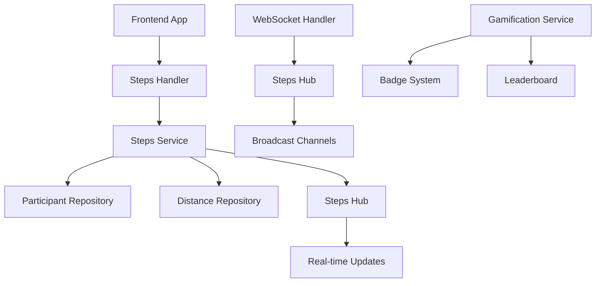

# 🏃 Steps App - Complete Technical Guide

> **Version:** 1.0
> **Status:** Production Ready
> **Last Updated:** 2025-11-07
> **Backend:** DKL Email Service V1.48.0+

Complete technische documentatie van het Steps App systeem voor het tracken van deelnemersstappen tijdens de Koninklijke Loop evenementen.

---

## 📋 Inhoudsopgave

1. [Executive Summary](#executive-summary)
2. [System Architecture](#system-architecture)
3. [Steps Tracking System](#steps-tracking-system)
4. [WebSocket Real-time Updates](#websocket-real-time-updates)
5. [Gamification Integration](#gamification-integration)
6. [API Endpoints](#api-endpoints)
7. [Models & Data Structures](#models--data-structures)
8. [Business Logic](#business-logic)
9. [Funds Distribution](#funds-distribution)
10. [Testing](#testing)
11. [Migration History](#migration-history)
12. [Related Documentation](#related-documentation)

---

## 🎯 Executive Summary

Het DKL Email Service implementeert een enterprise-grade Steps App systeem met:

### Kernfunctionaliteit
- ✅ **Steps Tracking** - Real-time stappen tracking voor deelnemers
- ✅ **WebSocket Updates** - Live updates via WebSocket connecties
- ✅ **Gamification** - Badge systeem en leaderboard integratie
- ✅ **Funds Distribution** - Proportionele fondsverdeling gebaseerd op stappen
- ✅ **Multi-tenant Support** - Ondersteuning voor meerdere evenementen
- ✅ **Real-time Dashboard** - Live dashboards voor deelnemers en admins
- ✅ **Route-based Allocation** - Fondsallocatie per route/afstand

### Technische Stack
- **Backend:** Go + Fiber framework
- **Real-time:** WebSocket met custom hub implementatie
- **Database:** PostgreSQL met GORM ORM
- **Architecture:** Service Layer + Repository Pattern
- **Broadcasting:** Channel-based message broadcasting

---

## 🏗️ System Architecture

### Component Overview



### Steps App Flow

1. **Registration:** Deelnemer registreert voor evenement
2. **Steps Tracking:** App trackt stappen via GPS/sensoren
3. **Real-time Updates:** WebSocket broadcasts naar connected clients
4. **Gamification:** Badge checks en leaderboard updates
5. **Funds Calculation:** Proportionele fondsverdeling

### Key Design Decisions

- **Real-time First:** WebSocket broadcasting voor live updates
- **Service Layer:** Gescheiden business logic van HTTP handlers
- **Channel-based:** Go channels voor thread-safe broadcasting
- **Subscription Model:** Clients kunnen specifieke updates subscriben

---

## 🏃 Steps Tracking System

### Core Components

#### StepsHandler - HTTP API Layer
```go
type StepsHandler struct {
    stepsService      *services.StepsService
    authService       services.AuthService
    permissionService services.PermissionService
}
```

**Key Features:**
- RESTful API endpoints voor stappen beheer
- JWT authentication en RBAC permissions
- Dual-mode endpoints (admin + participant flows)
- Error handling met Nederlandse berichten

#### StepsService - Business Logic Layer
```go
type StepsService struct {
    db              *gorm.DB
    participantRepo repository.ParticipantRepository
    distanceRepo    repository.DistanceRepository
    stepsHub        *StepsHub
}
```

**Key Features:**
- Steps delta calculation (voorkomt negatieve stappen)
- Fondsallocatie berekening per route
- WebSocket broadcasting integratie
- Database transaction management

#### StepsHub - Real-time Broadcasting
```go
type StepsHub struct {
    Clients             map[*StepsClient]bool
    StepUpdate          chan *StepUpdateMessage
    TotalUpdate         chan *TotalUpdateMessage
    LeaderboardUpdate   chan *LeaderboardUpdateMessage
    BadgeEarned         chan *BadgeEarnedMessage
    Register            chan *StepsClient
    Unregister          chan *StepsClient
}
```

**Key Features:**
- Channel-based message broadcasting
- Client subscription management
- Connection lifecycle handling
- Thread-safe operations

### Steps Update Flow

```go
// 1. Receive steps delta from app
deltaSteps := 500 // stappen van afgelopen periode

// 2. Update participant steps
participant.Steps += deltaSteps

// 3. Prevent negative steps
if participant.Steps < 0 {
    participant.Steps = 0
}

// 4. Save to database
participantRepo.Update(ctx, participant)

// 5. Broadcast real-time update
stepsHub.StepUpdate <- &StepUpdateMessage{
    Type:          "step_update",
    ParticipantID: participant.ID,
    Steps:         participant.Steps,
    Delta:         deltaSteps,
    Timestamp:     time.Now().Unix(),
}
```

---

## 🔌 WebSocket Real-time Updates

### WebSocket Architecture

#### Connection Establishment
```typescript
// Frontend WebSocket connection
const ws = new WebSocket('ws://localhost:8080/api/ws/steps?user_id=123&participant_id=456');

// Subscribe to updates
ws.send(JSON.stringify({
    type: "subscribe",
    channels: ["step_updates", "total_updates", "leaderboard_updates"]
}));
```

#### Message Types

##### StepUpdateMessage
```go
type StepUpdateMessage struct {
    Type           MessageType `json:"type"` // "step_update"
    ParticipantID  string      `json:"participant_id"`
    Naam           string      `json:"naam"`
    Steps          int         `json:"steps"`
    Delta          int         `json:"delta"`
    Route          string      `json:"route"`
    AllocatedFunds int         `json:"allocated_funds"`
    Timestamp      int64       `json:"timestamp"`
}
```

##### TotalUpdateMessage
```go
type TotalUpdateMessage struct {
    Type       MessageType `json:"type"` // "total_update"
    TotalSteps int         `json:"total_steps"`
    Year       int         `json:"year"`
    Timestamp  int64       `json:"timestamp"`
}
```

##### LeaderboardUpdateMessage
```go
type LeaderboardUpdateMessage struct {
    Type      MessageType        `json:"type"` // "leaderboard_update"
    TopN      int                `json:"top_n"`
    Entries   []LeaderboardEntry `json:"entries"`
    Timestamp int64              `json:"timestamp"`
}
```

### Client Management

#### StepsClient Structure
```go
type StepsClient struct {
    Hub           *StepsHub
    Conn          *websocket.Conn
    Send          chan []byte
    UserID        string
    ParticipantID string
    Subscriptions map[string]bool
}
```

#### Subscription System
```go
// Available channels
const (
    "step_updates"        // Individual participant updates
    "total_updates"       // Total steps updates
    "leaderboard_updates" // Leaderboard changes
    "badge_earned"        // Badge notifications
)
```

### Broadcasting Logic

#### Selective Broadcasting
```go
func (h *StepsHub) broadcastStepUpdate(update *StepUpdateMessage) {
    message, _ := json.Marshal(update)

    for client := range h.Clients {
        // Check subscription
        if client.Subscriptions["step_updates"] {
            // Send to relevant clients only
            if client.ParticipantID == "" || client.ParticipantID == update.ParticipantID {
                select {
                case client.Send <- message:
                default:
                    // Client buffer full - cleanup
                    close(client.Send)
                    delete(h.Clients, client)
                }
            }
        }
    }
}
```

---

## 🏆 Gamification Integration

### Badge System Integration

#### Steps-based Badges
```go
// Badge criteria examples
badgeCriteria := map[string]interface{}{
    "min_steps": 10000,  // 10K steps badge
}

badgeCriteria := map[string]interface{}{
    "consecutive_days": 7,  // Consistency badge
}
```

#### Achievement Tracking
```go
type ParticipantAchievement struct {
    ID            string    `json:"id" gorm:"primaryKey"`
    ParticipantID string    `json:"participant_id"`
    BadgeID       string    `json:"badge_id"`
    EarnedAt      time.Time `json:"earned_at"`
}
```

### Leaderboard System

#### Materialized View Performance (V25)
```sql
CREATE MATERIALIZED VIEW leaderboard_mv AS
SELECT
    a.id as participant_id,
    a.naam as display_name,
    a.email,
    a.afstand as route,
    a.steps,
    COALESCE(SUM(b.points), 0) as achievement_points,
    a.steps + COALESCE(SUM(b.points), 0) as total_score,
    RANK() OVER (ORDER BY (a.steps + COALESCE(SUM(b.points), 0)) DESC) as rank,
    COUNT(pa.id) as badge_count,
    a.created_at as joined_at,
    a.gebruiker_id,
    CASE
        WHEN a.gebruiker_id IS NOT NULL THEN true
        ELSE false
    END as has_user_account,
    g.naam as user_naam,
    g.is_actief as user_is_actief
FROM aanmeldingen a
LEFT JOIN participant_achievements pa ON a.id = pa.participant_id
LEFT JOIN badges b ON pa.badge_id = b.id AND b.is_active = true
LEFT JOIN gebruikers g ON a.gebruiker_id = g.id
GROUP BY a.id, g.id
ORDER BY total_score DESC;
```

#### Real-time Updates
```go
func (s *StepsService) broadcastLeaderboard() {
    if s.stepsHub == nil {
        return
    }

    var entries []LeaderboardEntry
    err := s.db.Table("leaderboard_view").
        Limit(10).
        Find(&entries).Error

    if err != nil {
        return
    }

    s.stepsHub.LeaderboardUpdate <- &LeaderboardUpdateMessage{
        Type:      MessageTypeLeaderboardUpdate,
        TopN:      10,
        Entries:   entries,
        Timestamp: time.Now().Unix(),
    }
}
```

---

## 🔌 API Endpoints

### Steps Management Endpoints

#### `POST /api/steps` - Update Own Steps
- **Purpose:** Deelnemer werkt eigen stappen bij
- **Auth:** JWT required
- **Permissions:** `steps:write`
- **Body:**
```json
{
  "steps": 500
}
```

#### `POST /api/steps/{id}` - Update Participant Steps (Admin)
- **Purpose:** Admin werkt stappen van specifieke deelnemer bij
- **Auth:** JWT required
- **Permissions:** `steps:write`
- **Body:** Same as above

### Dashboard Endpoints

#### `GET /api/participant/dashboard` - Own Dashboard
- **Purpose:** Deelnemer haalt eigen dashboard data op
- **Auth:** JWT required
- **Permissions:** `steps:read`
- **Response:**
```json
{
  "steps": 2500,
  "route": "10 KM",
  "allocatedFunds": 75,
  "naam": "John Doe",
  "email": "john@example.com"
}
```

#### `GET /api/participant/{id}/dashboard` - Participant Dashboard (Admin)
- **Purpose:** Admin haalt dashboard van specifieke deelnemer
- **Auth:** JWT required
- **Permissions:** `steps:read`

### Public Endpoints

#### `GET /api/total-steps` - Total Steps
- **Purpose:** Haal totaal aantal stappen op (public)
- **Auth:** None
- **Query Params:** `year` (optional)
- **Response:**
```json
{
  "total_steps": 125000,
  "year": 2025
}
```

#### `GET /api/funds-distribution` - Funds Distribution
- **Purpose:** Haal fondsverdeling op (public)
- **Auth:** None
- **Response:**
```json
{
  "totalX": 10000,
  "routes": {
    "6 KM": 2500,
    "10 KM": 3750,
    "15 KM": 2500,
    "20 KM": 1250
  }
}
```

### WebSocket Endpoint

#### `GET /api/ws/steps` - WebSocket Connection
- **Purpose:** Real-time updates via WebSocket
- **Auth:** Optional JWT token
- **Query Params:** `user_id`, `participant_id`, `token`
- **Protocol:** WebSocket with JSON messages

### Admin Endpoints

#### Route Funds Management
```
GET    /api/steps/admin/route-funds
POST   /api/steps/admin/route-funds
PUT    /api/steps/admin/route-funds/{route}
DELETE /api/steps/admin/route-funds/{route}
```

---

## 📊 Models & Data Structures

### Core Models

#### Participant (Steps-related fields)
```go
type Participant struct {
    ID        string `json:"id" gorm:"primaryKey"`
    Naam      string `json:"naam"`
    Email     string `json:"email"`
    Afstand   string `json:"afstand"` // Route/distance
    Steps     int    `json:"steps" gorm:"default:0"`
    // ... other fields
}
```

#### Distance (Route Configuration)
```go
type Distance struct {
    Route           string `json:"route" gorm:"primaryKey"` // "6 KM", "10 KM", etc.
    RegistrationFee int    `json:"registration_fee"`       // Funds allocated per route
}
```

#### RouteFund (Legacy Compatibility)
```go
type RouteFund struct {
    ID     string `json:"id" gorm:"primaryKey"`
    Route  string `json:"route" gorm:"uniqueIndex"`
    Amount int    `json:"amount"`
}
```

### WebSocket Message Types

#### MessageType Enum
```go
type MessageType string

const (
    MessageTypeStepUpdate        MessageType = "step_update"
    MessageTypeTotalUpdate       MessageType = "total_update"
    MessageTypeLeaderboardUpdate MessageType = "leaderboard_update"
    MessageTypeBadgeEarned       MessageType = "badge_earned"
    MessageTypeSubscribe         MessageType = "subscribe"
    MessageTypeUnsubscribe       MessageType = "unsubscribe"
    MessageTypePing              MessageType = "ping"
    MessageTypePong              MessageType = "pong"
)
```

#### LeaderboardEntry
```go
type LeaderboardEntry struct {
    Rank              int    `json:"rank"`
    ParticipantID     string `json:"participant_id"`
    Naam              string `json:"naam"`
    Steps             int    `json:"steps"`
    AchievementPoints int    `json:"achievement_points"`
    TotalScore        int    `json:"total_score"`
    Route             string `json:"route"`
    BadgeCount        int    `json:"badge_count"`
}
```

---

## 🧠 Business Logic

### Steps Update Logic

#### Delta-based Updates
```go
func (s *StepsService) UpdateSteps(participantID string, deltaSteps int) (*models.Participant, error) {
    // 1. Fetch participant
    participant, err := s.participantRepo.GetByID(ctx, participantID)

    // 2. Calculate new steps (prevent negative)
    newSteps := participant.Steps + deltaSteps
    if newSteps < 0 {
        newSteps = 0
    }
    participant.Steps = newSteps

    // 3. Save to database
    err = s.participantRepo.Update(ctx, participant)

    // 4. Broadcast update
    s.broadcastStepUpdate(participant, deltaSteps)

    return participant, nil
}
```

#### User-based Updates
```go
func (s *StepsService) UpdateStepsByUserID(userID string, deltaSteps int) (*models.Participant, error) {
    // Find participant by user_id
    var participant models.Participant
    err := s.db.Where("gebruiker_id = ?", userID).First(&participant).Error

    // Update steps using participant ID
    return s.UpdateSteps(participant.ID, deltaSteps)
}
```

### Funds Distribution Logic

#### Proportional Distribution
```go
func (s *StepsService) GetFundsDistributionProportional() (map[string]int, int, error) {
    // 1. Get all distances/routes
    distances, err := s.distanceRepo.GetAll(ctx)

    // 2. Calculate total funds
    totalFunds := 0
    for _, d := range distances {
        totalFunds += d.RegistrationFee
    }

    // 3. Count participants per route
    distribution := make(map[string]int)
    totalParticipants := 0

    for _, d := range distances {
        var count int64
        s.db.Model(&models.Participant{}).Where("afstand = ?", d.Route).Count(&count)
        totalParticipants += int(count)
        distribution[d.Route] = int(count)
    }

    // 4. Calculate proportional allocation
    if totalParticipants > 0 {
        for route, count := range distribution {
            for _, d := range distances {
                if d.Route == route {
                    distribution[route] = (d.RegistrationFee * count) / totalParticipants
                    break
                }
            }
        }
    }

    return distribution, totalFunds, nil
}
```

---

## 💰 Funds Distribution

### Route-based Allocation

#### Distance Configuration
```sql
-- Distances table stores route configurations
CREATE TABLE distances (
    route VARCHAR(100) PRIMARY KEY,
    registration_fee INTEGER NOT NULL
);

-- Sample data
INSERT INTO distances (route, registration_fee) VALUES
    ('6 KM', 50),
    ('10 KM', 75),
    ('15 KM', 100),
    ('20 KM', 125);
```

#### Allocation Calculation
```go
func (s *StepsService) CalculateAllocatedFunds(route string) int {
    distance, err := s.distanceRepo.GetByRoute(ctx, route)
    if err != nil {
        // Fallback values
        switch route {
        case "6 KM": return 50
        case "10 KM": return 75
        case "15 KM": return 100
        case "20 KM": return 125
        default: return 50
        }
    }
    return distance.RegistrationFee
}
```

### Proportional Distribution Algorithm

1. **Count Participants:** Tel aantal deelnemers per route
2. **Calculate Weights:** Bepaal proportionele verdeling
3. **Allocate Funds:** Verdeel totaalbedrag volgens gewichten

```go
// Example: 100 participants, €10,000 total
// Route A: 40 participants → 40% = €4,000
// Route B: 35 participants → 35% = €3,500
// Route C: 25 participants → 25% = €2,500
```

---

## 🧪 Testing

### Unit Tests

#### Steps Service Tests
```go
func TestStepsService_UpdateSteps(t *testing.T) {
    // Setup
    service, mockRepo := setupStepsService(t)

    // Mock participant
    participant := &models.Participant{
        ID:    "test-id",
        Steps: 1000,
    }
    mockRepo.On("GetByID", mock.Anything, "test-id").Return(participant, nil)
    mockRepo.On("Update", mock.Anything, mock.Anything).Return(nil)

    // Execute
    result, err := service.UpdateSteps("test-id", 500)

    // Assert
    assert.NoError(t, err)
    assert.Equal(t, 1500, result.Steps)
    mockRepo.AssertExpectations(t)
}
```

#### WebSocket Tests
```go
func TestStepsHub_BroadcastStepUpdate(t *testing.T) {
    // Setup hub with mock clients
    hub := NewStepsHub(nil, nil)

    // Create mock clients with subscriptions
    client1 := &StepsClient{
        Send:          make(chan []byte, 1),
        Subscriptions: map[string]bool{"step_updates": true},
    }
    client2 := &StepsClient{
        Send:          make(chan []byte, 1),
        Subscriptions: map[string]bool{}, // No subscriptions
    }

    hub.Clients[client1] = true
    hub.Clients[client2] = true

    // Broadcast update
    update := &StepUpdateMessage{
        Type:          MessageTypeStepUpdate,
        ParticipantID: "test-participant",
        Steps:         1500,
    }

    hub.StepUpdate <- update

    // Wait for broadcast
    time.Sleep(10 * time.Millisecond)

    // Check client1 received message
    select {
    case msg := <-client1.Send:
        var received StepUpdateMessage
        json.Unmarshal(msg, &received)
        assert.Equal(t, update.Steps, received.Steps)
    default:
        t.Error("Expected message not received by subscribed client")
    }

    // Check client2 did not receive message
    select {
    case <-client2.Send:
        t.Error("Unsubscribed client should not receive message")
    default:
        // Expected - no message
    }
}
```

### Integration Tests

#### API Integration Test
```go
func TestStepsAPI_UpdateSteps(t *testing.T) {
    // Setup test app
    app := setupTestApp(t)

    // Create test participant
    participantID := createTestParticipant(t)

    // Test request
    req := httptest.NewRequest("POST", "/api/steps/"+participantID, strings.NewReader(`{"steps": 500}`))
    req.Header.Set("Content-Type", "application/json")
    req.Header.Set("Authorization", "Bearer "+testToken)

    resp, err := app.Test(req)
    assert.NoError(t, err)
    assert.Equal(t, 200, resp.StatusCode)

    // Verify steps updated in database
    var participant models.Participant
    db.First(&participant, "id = ?", participantID)
    assert.Equal(t, 500, participant.Steps)
}
```

---

## 📋 Migration History

### Steps System Evolution

#### V16: Initial Steps Tracking
- Added `steps` column to `aanmeldingen` table
- Basic steps increment functionality
- Manual steps updates via admin interface

#### V17: Route Funds System
- Created `route_funds` table
- Distance-based fund allocation
- Proportional distribution logic

#### V26-V28: Major Refactoring
- **V26:** Normalized distances (route_funds → distances)
- **V27:** Status field normalization
- **V28:** Participant/EventRegistration split
  - Split `aanmeldingen` table into `participants` + `event_registrations`
  - Moved event-specific data (including steps) to `event_registrations`
  - Maintained participant-level aggregation for dashboard/stats

#### V1.48: WebSocket Integration
- Real-time WebSocket broadcasting
- StepsHub implementation
- Subscription-based updates
- Live leaderboard updates

### Key Migration Patterns

#### Adding Steps Column
```sql
-- V16: Add steps to aanmeldingen
ALTER TABLE aanmeldingen ADD COLUMN steps INTEGER DEFAULT 0;

-- V28: Add steps to event_registrations
ALTER TABLE event_registrations ADD COLUMN steps INTEGER DEFAULT 0;
```

#### Route Funds Migration
```sql
-- V17: Create route_funds table
CREATE TABLE route_funds (
    id UUID PRIMARY KEY DEFAULT gen_random_uuid(),
    route VARCHAR(255) UNIQUE NOT NULL,
    amount INTEGER NOT NULL
);

-- V26: Rename to distances
ALTER TABLE route_funds RENAME TO distances;
ALTER TABLE distances RENAME COLUMN amount TO registration_fee;
```

---

## 📚 Related Documentation

- [`01DATABASE_DOC.md`](01DATABASE_DOC.md) - Database architecture overview
- [`02AUTHENTICATION_DOC.md`](02AUTHENTICATION_DOC.md) - Authentication & authorization system
- [`03PARTICIPANT_DOC.md`](03PARTICIPANT_DOC.md) - Participant management system
- [`04EMAIL_DOC.md`](04EMAIL_DOC.md) - Email processing architecture
- [`docs/STEPS_API_FRONTEND.md`](docs/STEPS_API_FRONTEND.md) - Frontend API integration
- [`docs/EVENT_TRACKING_IMPLEMENTATION.md`](docs/EVENT_TRACKING_IMPLEMENTATION.md) - GPS tracking system
- [`docs/WEBSOCKET_IMPLEMENTATION.md`](docs/WEBSOCKET_IMPLEMENTATION.md) - WebSocket technical details

---

## ⚠️ Critical Implementation Notes

### Performance Considerations

- **WebSocket Scalability:** Hub design supports thousands of concurrent connections
- **Broadcast Efficiency:** Selective broadcasting voorkomt unnecessary messages
- **Database Indexing:** Steps and participant queries properly indexed
- **Connection Limits:** Client send buffers prevent memory exhaustion

### Real-time Architecture

- **Channel-based Broadcasting:** Thread-safe message distribution
- **Subscription Model:** Clients receive only relevant updates
- **Connection Lifecycle:** Automatic cleanup van disconnected clients
- **Ping/Pong:** Connection health monitoring

### Security Considerations

- **Authentication:** JWT validation voor WebSocket connections
- **Authorization:** Permission checks voor steps updates
- **Input Validation:** Steps delta validation voorkomt abuse
- **Rate Limiting:** Prevent excessive API calls

### Data Integrity

- **Transaction Safety:** Database updates in transactions
- **Negative Prevention:** Steps cannot go below zero
- **Audit Trail:** All steps changes logged via broadcasting
- **Consistency:** Real-time updates reflect database state

---

**Version:** 1.0
**Last Updated:** 2025-11-07
**Status:** ✅ Production Ready
**Compatibility:** DKL Email Service V1.48.0+
**Architecture:** Service Layer + WebSocket Broadcasting