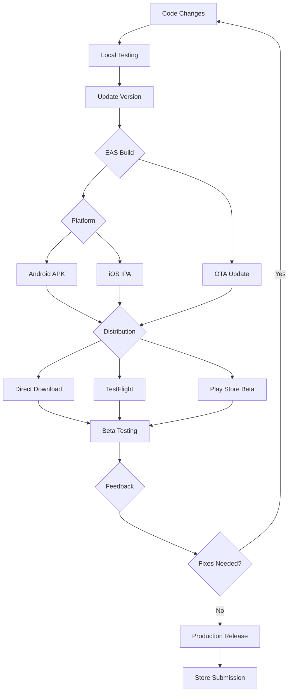

# 03-deployment

Dit is de deployment sectie van de DKL Steps App documentatie. Hier vind je alles wat je nodig hebt voor het uitrollen van de app naar testers en productie.

## 📋 Overzicht

Deze sectie behandelt alle aspecten van deployment, van lokale builds tot productie releases. De documentatie is gebaseerd op de daadwerkelijke codebase en gebruikt Expo EAS (Expo Application Services) als primaire deployment tool.

## 📚 Documenten

### Core Deployment Guides
- **[`BETA_DEPLOYMENT.md`](BETA_DEPLOYMENT.md)** - Complete guide voor beta testing setup, builds en distributie
- **[`CI_CD.md`](CI_CD.md)** - Geautomatiseerde workflows voor continuous integration en deployment
- **[`MONITORING.md`](MONITORING.md)** - Post-deployment monitoring, analytics en crash reporting
- **[`PRODUCTION_TRANSITION.md`](PRODUCTION_TRANSITION.md)** - Migratie van beta naar productie release

### Quick Reference
- [EAS Build Configuratie](BETA_DEPLOYMENT.md#stap-3-project-configureren) - `eas.json` setup
- [App Store Submission](BETA_DEPLOYMENT.md#optie-3-store-beta-programs) - TestFlight & Play Store
- [OTA Updates](BETA_DEPLOYMENT.md#optie-2-expo-updates-ota) - Over-the-air updates zonder rebuild
- [Build Troubleshooting](BETA_DEPLOYMENT.md#common-build-issues) - Veelvoorkomende problemen oplossen

## 🔄 Deployment Flow Diagram



## 🔗 Gerelateerde Documentatie

- **[02-development](../02-development/README.md)** - Voor development setup en lokale testing
- **[04-reference/CHANGELOG.md](../04-reference/CHANGELOG.md)** - Version history en release notes
- **[07-optimization](../07-optimization/README.md)** - Performance optimalisaties die deployment impact hebben
- **[08-testing](../08-testing/README.md)** - Testing strategieën voor pre-deployment validation

## 🚀 Quick Start Commands

### Android Beta Build (15 minuten)
```bash
eas build --platform android --profile preview
```

### iOS Beta Build (Apple Developer account nodig)
```bash
eas build --platform ios --profile production
eas submit --platform ios
```

### OTA Update (JS changes only)
```bash
eas update --branch beta --message "Bug fix description"
```

## 📊 Build Status Monitoring

- **Expo Dashboard**: https://expo.dev/accounts/jeffreyed/projects/dkl-steps-app/builds
- **Build Queue**: `eas build:list`
- **Build Details**: `eas build:view [BUILD_ID]`

## ⚠️ Belangrijke Opmerkingen

- **Android Pedometer**: Werkt alleen in standalone builds, niet in Expo Go
- **iOS Requirements**: Apple Developer account ($99/jaar) voor TestFlight
- **Build Times**: 10-20 minuten afhankelijk van queue
- **Concurrent Builds**: Vermijd meerdere builds tegelijkertijd

## 🎯 Deployment Strategieën

### Fase 1: Internal Testing
- Development builds voor 5-10 interne testers
- Focus op core functionaliteit en bug hunting

### Fase 2: Closed Beta
- Preview builds voor 20-30 testers
- Real-world testing en UX feedback

### Fase 3: Open Beta
- Production builds voor 100+ testers
- Scale testing en final validation

### Fase 4: Production Release
- Store submission via EAS submit
- Public launch en monitoring

## 📞 Support

- **Build Issues**: Check [Common Build Issues](BETA_DEPLOYMENT.md#common-build-issues)
- **Beta Testing**: Gebruik de [Beta Testing Script](BETA_DEPLOYMENT.md#beta-testing-script-voor-testers)
- **Production Help**: Zie [Production Transition](PRODUCTION_TRANSITION.md)

---

**Laatste Update**: November 2025
**Version**: 1.1.0